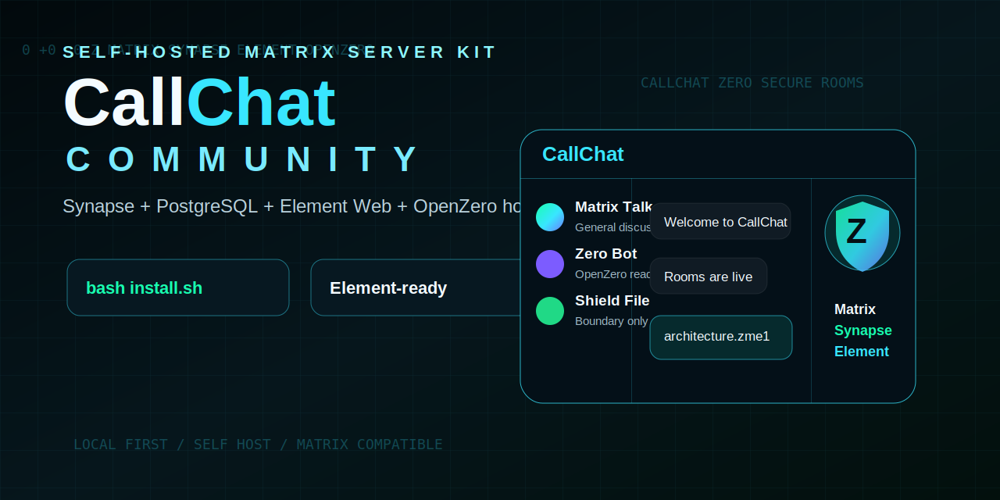

# CallChat Community

Self-hosted Matrix chat with a CallChat front door, a branded Element Web profile, Synapse/PostgreSQL templates, an E2EE-only Zero Bot example, owner-controlled MatrixRTC guidance, and a reviewable ZShield ZME1 message-and-file baseline.

The primary hosted client is now CallChat Shield at
[`callchat.org/app/`](https://callchat.org/app/). The reusable Community
configuration, command surface, home workspace, branding assets and distribution
test are public in [`client/community`](client/community/). The full maintained
client source is published at
[`ResearchForumOnline/CallChat-Community`](https://github.com/ResearchForumOnline/CallChat-Community),
based on Element Web `v1.12.23` under its AGPL/GPL licensing terms.

Element remains a supported compatibility client for official mobile and desktop
apps. The hosted Shield edition uses the same public client with separate
server-side entitlement, policy, managed recovery and customer operations; it is
not a hidden proprietary modification of the AGPL web client.

<p align="center">
  
</p>

<p align="center">
  <a href="https://callchat.org/"></a>
  <a href="https://callchat.org/license/"></a>
  <a href="https://github.com/ResearchForumOnline/CallChat/releases/tag/v0.2.0"></a>
  <a href="docs/install.md"></a>
  <a href="docs/openzero-integration.md"></a>
</p>

## Q Call Secure Comms License

Q Call is the commercial CallChat secure-communications offer for teams that want private calls, messages, and protected files on infrastructure they control. The standards-based ZME1 browser baseline is public and testable; premium entitlement, managed recovery, enterprise policy, and private ZMath research remain separate.

- Live license page: [callchat.org/license](https://callchat.org/license/)
- Pricing: USD $55 per month or USD $550 per year.
- Scope: unlimited users on one approved public server IP per license.
- Buyer path: live capture page, direct buy button, and follow-up route for setup questions.
- Current call layer: hosted CallChat web calls use MatrixRTC/LiveKit frame E2EE with a required in-memory ZMath factor; WebRTC transport protection and TURN remain in the path.
- Current local protection: the public ZME1 baseline creates an authenticated AES-256-GCM container in the browser before Matrix uploads the file.
- Roadmap: reviewed adoption of standardized post-quantum key establishment and signatures; no claim that current live audio is quantum encrypted.

See [docs/qcall-secure-comms-license.md](docs/qcall-secure-comms-license.md) for the buyer profile, sales flow, claim wording, and public/private boundary.

## What This Repo Gives You

- A cloneable starter kit for a CallChat-style homeserver.
- Synapse + PostgreSQL Docker templates.
- Apache and Nginx reverse proxy examples.
- Matrix `.well-known` discovery examples.
- Element Web download/configuration and CallChat theme hooks.
- A PHP/HTML/CSS/JS landing page that works on Apache/CWP style hosting.
- Q Call license landing-page copy and safe buy/capture links for the live offer.
- A CLI installer for one-server deployments.
- A small PHP setup UI that generates safe configs without needing Node, Python, or a database.
- A website widget that can be copied into an existing site and pointed at an approved AI/agent endpoint.
- Scripts for health checks, backups, and release packaging.
- Docs for DNS, installation, admin tasks, Element setup, TURN calls, OpenZero, updates, and public safety boundaries.
- Optional AI bot integration notes for OpenZero-style local agents.
- A runnable Matrix E2EE Zero Bot that refuses unencrypted and allow-all room policies.
- A local Web Crypto ZShield workspace for messages and files, ZME1 interoperability profile, threat model, test vector, and negative tests.
- A server-backed Synapse reCAPTCHA registration template with rate limits.
- An optional server-side IonQ simulator receipt endpoint that stays outside the encryption key path.
- Truthful JSON status schemas for Shield and owner-controlled MatrixRTC/Q Calls.

## What This Repo Does Not Include

This public repository does not include private deployment material:

- Private ZMath research, premium entitlement, managed recovery, or enterprise policy source.
- Matrix signing keys.
- Database passwords.
- Synapse shared registration secrets.
- Matrix access tokens.
- SSH keys, API keys, or server credentials.
- Production backups.
- Private entitlement or licensing code.

Standard Matrix chat can be self-hosted from this repo. The public ZShield baseline creates authenticated local messages and `.zme1` files through Web Crypto; it is not the private premium ZMath policy layer and it does not claim live audio is quantum encrypted.

## Verified Security Baseline

- Current CallChat rooms are configured with Matrix Megolm E2EE. Encryption protects new encrypted events; it does not retroactively encrypt earlier room history.
- Zero Bot uses `matrix-nio[e2e]` with a persistent Olm/Megolm store and explicitly approved rooms.
- ZShield encrypts chat messages, files, or vault notes locally before users paste the envelope or attach the `.zme1` container.
- Optional IonQ simulator receipts authenticate research context only; they never supply ZShield keys or receive plaintext.
- Hosted CallChat web calls require the unlocked ZMath factor and combine it in memory with rotating MatrixRTC media keys before LiveKit frame encryption. The legacy one-to-one fallback is disabled in the hosted profile.
- The PQC work is a roadmap. CallChat does not claim that today’s audio packets use post-quantum encryption.

Reproducible evidence and exact limits: [docs/release-evidence-20260710.md](docs/release-evidence-20260710.md), [docs/capability-boundary.md](docs/capability-boundary.md), [docs/zme1-public-profile-v1.md](docs/zme1-public-profile-v1.md), and [docs/zshield-threat-model-v1.md](docs/zshield-threat-model-v1.md).

## Layered File Protection

When ZMath protection is enabled, the original file is wrapped locally before
Matrix applies its own encrypted attachment and room-event layers:

```text
Original document
        |
        v
ZMath passphrase + exact pattern
        |
        v
Authenticated AES-256-GCM ZME1 container
filename.docx.zme1
        |
        v
Matrix A256CTR encrypted attachment
        |
        v
Megolm-encrypted room event
        |
        v
CallChat infrastructure receives encrypted payloads
```

This is layered client-side protection, not a claim that all service metadata
disappears. See [Layered file protection](docs/LAYERED_FILE_PROTECTION.md) for
the security boundary and limits.

## Architecture

CallChat Community keeps the proven Matrix stack and wraps it in a CallChat deployment layer:

- `callchat.org` style public domain: website, docs, downloads, `.well-known`, and optional hosted web client.
- `matrix.example.com` style API domain: Synapse client/server API behind HTTPS.
- Synapse: Matrix homeserver.
- PostgreSQL: production database.
- Element Web: Matrix-compatible web client, configured and themed for the deployment.
- TURN/coturn: voice/video relay for real-world networks.
- Optional Zero Bot: a consent-based Matrix bot that can connect to OpenZero or another local LLM bridge.

## Quick Start

Fast operator path:

```bash
git clone https://github.com/ResearchForumOnline/CallChat.git
cd CallChat
bash install.sh
```

The wizard writes local config files only. It does not expose secrets or change your web server without you running the deploy step.

Manual path:

1. Copy `.env.example`:

   ```bash
   cp infra/synapse/.env.example infra/synapse/.env
   ```

2. Edit the values for your domain. Do not reuse the example passwords.

3. Generate a Synapse config for your final server name:

   ```bash
   cd infra/synapse
   docker compose run --rm synapse generate
   ```

4. Start the stack:

   ```bash
   docker compose up -d
   ```

5. Put the web files under your public web root and expose the Matrix reverse proxy.

6. Run the health check:

   ```bash
   bash scripts/healthcheck.sh https://example.com https://matrix.example.com
   ```

Read [docs/install.md](docs/install.md) before production use.

## Install Modes

| Mode | Command | What it does |
| --- | --- | --- |
| Wizard | `bash install.sh` | Interactive domain/config builder. |
| Stack | `bash scripts/callchatctl.sh start-stack` | Starts Synapse/PostgreSQL Docker compose. |
| Element Web | `bash scripts/callchatctl.sh install-element` | Downloads Element Web and writes CallChat config. |
| OpenZero | `bash scripts/callchatctl.sh install-openzero` | Runs the public OpenZero installer hook. |
| Website widget | `bash scripts/callchatctl.sh install-widget /var/www/site/public` | Adds the CallChat agent widget to an existing site with a backup. |
| Agent bridge | `python3 ai/zero_agent_bridge.py` | Example rate-limited widget backend for OpenZero/fallback answers. |
| Status | `bash scripts/callchatctl.sh status` | Checks Matrix discovery/API and optional widget files. |

See [docs/cli-installer.md](docs/cli-installer.md).

## Element Compatibility

CallChat does not replace the Matrix protocol. It gives a CallChat-branded route into it.

Users can connect with:

- Hosted Element Web.
- Official Element Android/iOS/desktop clients.
- Other compatible Matrix clients.
- Future CallChat-native clients.

Standard Matrix messaging remains compatible. ZMath-protected hosted calls
require the matching CallChat web client because unmodified clients do not
implement the additional media factor.

For security and licensing hygiene, this repo configures and themes upstream Element Web instead of hiding upstream code inside CallChat.

## OpenZero Integration

OpenZero can power a CallChat room bot, public site widget, and local voice/AI bridge. This repo does not copy OpenZero internals; it installs or links to the official OpenZero project so updates and license boundaries remain clear.

Read [docs/openzero-integration.md](docs/openzero-integration.md).

## Update Policy

You can pin versions for stability, but do not freeze security-critical software forever. Synapse, Element Web, Docker images, and OS packages receive security updates. The recommended model is:

- Pin exact versions in production.
- Test updates in staging.
- Back up before upgrades.
- Roll forward promptly for security fixes.
- Keep CallChat branding/config separate from upstream code.

See [docs/update-policy.md](docs/update-policy.md).

## Shield Boundary

CallChat Shield / ZMath is an optional premium vault layer for protected files and advanced workflows. This public repo describes:

- User-facing behaviour.
- Safe integration boundaries.
- Licensing model.
- What clients should show when a Shield file is present.

It publishes the standards-based ZME1 reference implementation, but not proprietary premium policy or private ZMath research. See [docs/zmath-boundary.md](docs/zmath-boundary.md), [docs/ionq-research-receipts.md](docs/ionq-research-receipts.md), and [docs/matrix-captcha-registration.md](docs/matrix-captcha-registration.md).

The current public offer is the Q Call secure-comms license: USD $55/month or USD $550/year for unlimited users on one approved public server IP. The public repo documents the offer, customer flow, public cryptographic baseline, and safe integration points; private research, credentials, entitlement logic, and managed recovery stay outside GitHub.

The hosted Element experience now has a reviewable, no-AI-API ZMath Auto
controller for protecting composer messages and selected files in the browser.
Its standards-based cryptographic profile and integration contract are public;
private research, entitlement services, credentials, and managed recovery remain
outside this repository. See [ZMath Auto for Element](docs/zmath-auto-element.md).

## License

CallChat Community files in this repository are released under the MIT License unless a file states otherwise.

Third-party projects such as Synapse, Element Web, Matrix SDKs, Docker images, and operating system packages keep their own licenses. Check [NOTICE.md](NOTICE.md) before redistributing combined builds.
